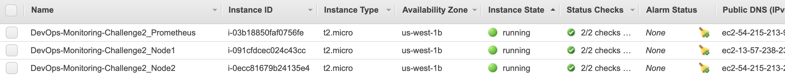
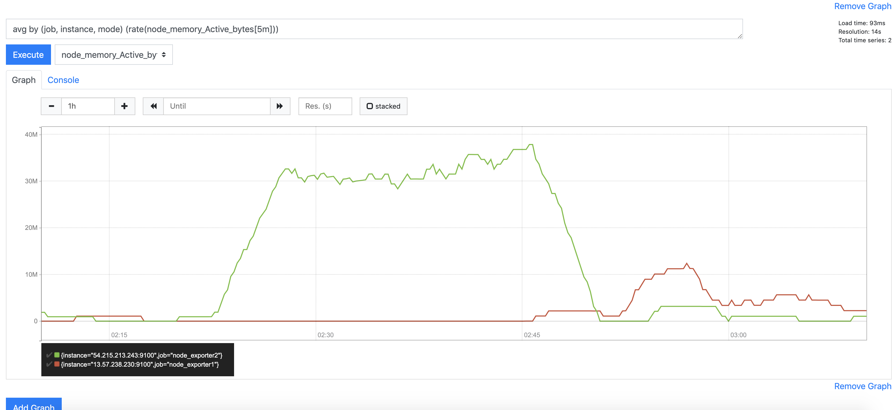
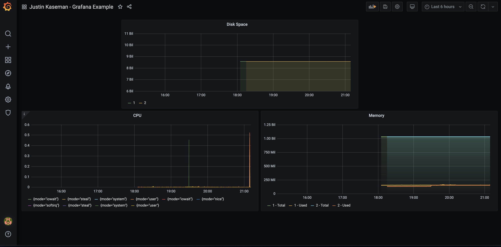

### Steps
1. Started 3 EC2 instances launched into my VPC with a public subnet.

2. Verified ability of EC2 instances to accept HTTP requests & accept SSH connections.

3. Set up Prometheus server by SSH'ing into one instance and following https://devopscube.com/install-configure-prometheus-linux/

4. Set up Node Exporter on the remaining 2 EC2 instances to monitor traffic following https://kbild.ch/blog/2019-02-18-awsprometheus/

5. Installed Grafana on the Prometheus server using the Linux Binary from https://grafana.com/grafana/download

6. Built visualizations for CPU, Memory, and Disk space

### Additional resources:

- https://pepipost.com/tutorials/setup-prometheus-and-exporters/
- https://www.digitalocean.com/community/tutorials/how-to-install-prometheus-on-ubuntu-16-04